``` {r echo=FALSE}
knitr::opts_chunk$set(fig.pos = "H", out.extra = "", echo = F,  fig.align="center", out.width="15cm")
```

```{=latex}
\partone
```

**Please Note:** For each of the graphs in this section, the scale was kept consistent; each division is one millisecond.

```{=latex}
\begin{enumerate}
\item \underline{\bf C Tuning Fork - 512 Hz:}
```

\color{red}

``` {r c4, fig.cap="C4 Fork Graph", echo = FALSE}
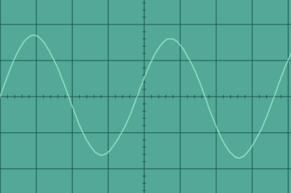
```

\begin{eqnarray}
\text{freq} & = & 0.2 \cdot 19.5 \\
            & = & 3.9 \\
            & = & \frac{39}{1000} \\
            & = & 0.0039 \\
            & = & \frac{1}{0.0039} \\
            & = & 256.41
\end{eqnarray}

See Figure \ref{fig:c4} for image.

**Frequency:** 256.41 Hz \par
**Expected Frequency:** 
**Percent Error: ** 0.2\% 

\color{black}

```{=latex}
\item \underline{\bf B Tuning Fork - 480 Hz:}
\color{red}
```

``` {r b4, fig.cap="B Tuning Fork Graph", echo = FALSE}
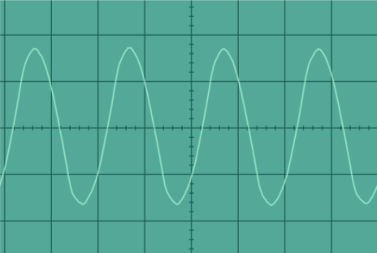
```

\begin{eqnarray}
  \text{freq} & = & 0.2 \cdot 10 \\
              & = & 2 \\
              & = & \frac{2}{1000} \\
              & = & 0.002 \\
              & = & \frac{1}{002} \\
              & = & 500
\end{eqnarray}

See Figure \ref{fig:b4} for image.

**Frequency:** 500 Hz \par
**Expected Frequency:** 480 Hz \par
**Percent Error: ** 4\%

\color{black}

```{=latex}
\item \underline{\bf A Tuning Fork - 426.6 Hz:}
\color{red}
```

``` {r a4, fig.cap="A Tuning Fork Graph"}
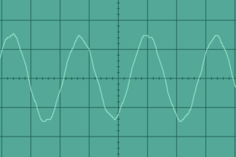
```

\begin{eqnarray}
  \text{freq} & = & 0.2 \cdot 12 \\
              & = & 2.4 \\
              & = & \frac{2.4}{1000} \\
              & = & 0.0024 \\
              & = & \frac{1}{0024} \\
              & = & 416.67
\end{eqnarray}

See Figure \ref{fig:a4} for image.

**Frequency:** 416.67 Hz \par
**Expected Frequency:** 426.6 Hz \par
**Percent Error: ** 2.33\%

\color{black}

```{=latex}
\item \underline{\bf G Tuning Fork - 384 Hz:}
\color{red}
```

``` {r g4, fig.cap="G4 Tuning Fork Graph"}
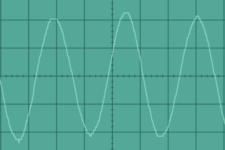
```

\begin{eqnarray}
  \text{freq} & = & 0.2 \cdot 12.5 \\
              & = & 2.5 \\
              & = & \frac{2.5}{1000} \\
              & = & 0.0025 \\
              & = & \frac{1}{0.0025} \\
              & = & 400
\end{eqnarray}

See Figure \ref{fig:g4} for image.

**Frequency:** 400 Hz \par
**Expected Frequency:** 384 Hz \par
**Percent Error: ** 4%

```{=latex}
\color{black}
\item \underline{\bf F Tuning Fork - 341.3 Hz:}
\color{red}
```

``` {r f4, fig.cap="F Tuning Fork Graph"}
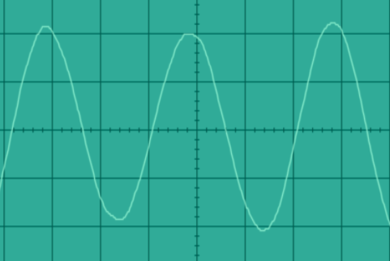
```

\begin{eqnarray}
  \text{freq} & = & 0.2 \cdot 15 \\
              & = & 3 \\
              & = & \frac{3}{1000} \\
              & = & 0.003 \\
              & = & \frac{1}{0.003} \\
              & = & 333.33
\end{eqnarray}

See Figure \ref{fig:f4} for image.

**Frequency:** 333.33 Hz \par
**Expected Frequency:** 341.3 Hz \par
**Percent Error: ** 2%

```{=latex}
\color{black}
\item \underline{\bf E Tuning Fork - 320 Hz:}
\color{red}
```

``` {r e4, fig.cap="E Tuning Fork Graph"}
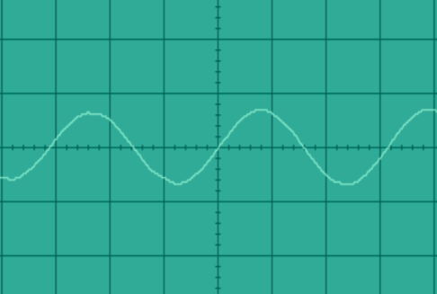
```

\begin{eqnarray}
  \text{freq} & = & 0.2 \cdot 16 \\
              & = & 3.2 \\
              & = & \frac{3.2}{1000} \\
              & = & 0.0032 \\
              & = & \frac{1}{0.0032} \\
              & = & 312.5
\end{eqnarray}

See Figure \ref{fig:e4} for image.

**Frequency:** 312.5 Hz \par
**Expected Frequency:** 320 Hz \par
**Percent Error: ** 2%

```{=latex}
\color{black}
\item \underline{\bf D Tuning Fork - 288 Hz:}
\color{red}
```

``` {r d4, fig.cap="D Tuning Fork Graph"}
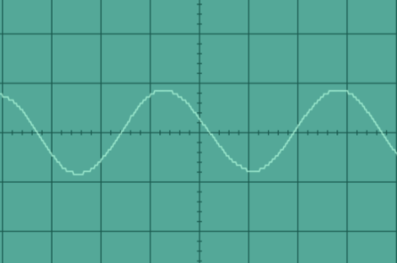
```

\begin{eqnarray}
  \text{freq} & = & 0.2 \cdot 17.5 \\
              & = & 3.5 \\
              & = & \frac{3.5}{1000} \\
              & = & 0.0035 \\
              & = & \frac{1}{0.0035} \\
              & = & 285.71
\end{eqnarray}

See Figure \ref{fig:d4} for image.

**Frequency:** 285.71 Hz \par
**Expected Frequency:** 288 Hz \par
**Percent Error: ** 1%

```{=latex}
\color{black}
\item \underline{\bf C Tuning Fork - 256 Hz:}
\color{red}
```

``` {r c5, fig.cap="C5 Tuning Fork Graph"}
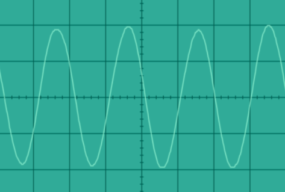
```

\begin{eqnarray}
  \text{freq} & = & 0.2 \cdot 9.5 \\
              & = & 1.9 \\
              & = & \frac{1.9}{1000} \\
              & = & 0.0019 \\
              & = & \frac{1}{0.0019} \\
              & = & 526.32
\end{eqnarray}

See Figure \ref{fig:c5} for image.

**Frequency:** 526.32 Hz \par
**Expected Frequency:** 512 Hz \par
**Percent Error: ** 3%

```{=latex}
\end{enumerate}
```

\parttwo

```{=latex}
\begin{enumerate}
```

```{=latex}
\item \underline{\bf First combination (state clearly which notes and their frequencies):}
\color{red}
%%%%include screen-shots and calculations here using different colour.
```
**First Note:** F4 (341 Hz) \par
**Second Note:** B4 (480 Hz)

```{=latex}
\color{black}
\item \underline{\bf Second combination (state clearly which notes and their frequencies):}
%%%%include screen-shots and calculations here using different colour.
\color{red}
```

**First Note:** F4 (341 Hz) \par
**Second Note:** G4 (384 Hz)

```{=latex}
\color{black}
\item \underline{\bf Third combination (state clearly which notes and their frequencies):}
%%%%include screen-shots and calculations here using different colour.
\color{red}
```

**First Note:** C5 (512 Hz) \par
**Second Note:** G4 (384 Hz)

```{=latex}
\color{black}
\end{enumerate}
```

\partthree

```{=latex}
\begin{enumerate}
```

```{=latex}
\item \underline{\bf First beat:}
\color{red}
```

``` {r beat1, fig.cap="Graph of the First Beat"}
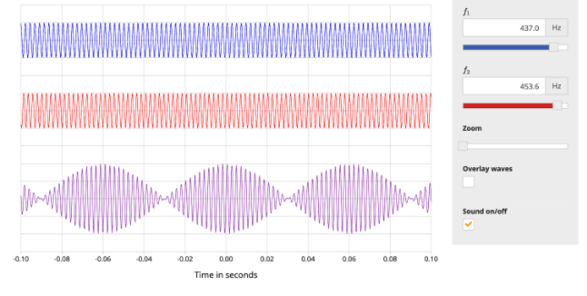
```

**Frequency 1:** 437 Hz \par
**Frequency 2:** 453.6 Hz \par

Click [here](https://drive.google.com/file/d/1oXFQMKwtDi49notKpu_14QgbBMQKakrs/view?usp=sharing) to listen to the recording

```{=latex}
\color{black}
\item \underline{\bf Second beat:}
\color{red}
```

``` {r beat2, fig.cap="Graph of the Second Beat"}
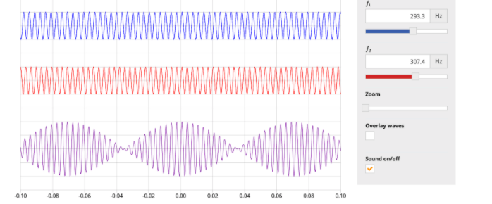
```

**Frequency 1:** 293.3 Hz \par
**Frequency 2:** 307.4 Hz \par

Click [here](https://drive.google.com/file/d/1oeeTuEsuQm12f_mGFPHBa7d3HnDYG668/view?usp=sharing) to listen to the recording

```{=latex}
\color{black}
\item \underline{\bf Third beat:}
\color{red}
```

``` {r beat3, fig.cap="Graph of the Third Beat"}
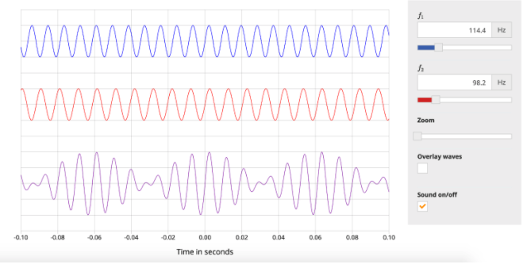
```

**Frequency 1:** 114.4 Hz \par
**Frequency 2:** 98.2 Hz \par

Click [here](https://drive.google.com/file/d/1HDnGARGU-zLe6rnKFT0szBtuhRpNQbNN/view?usp=sharing) to listen to the recording

```{=latex}
\color{black}
\end{enumerate}
```
