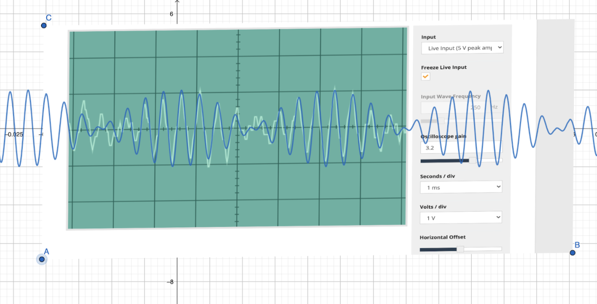

``` {r echo=FALSE}
knitr::opts_chunk$set(fig.pos = "H", out.extra = "", echo = F,  fig.align="center", out.width="15cm")
```

```{=latex}
\partone
```

**Please Note:** For each of the graphs in this section, the scale was kept consistent; each division is one millisecond.

```{=latex}
\begin{enumerate}
\item \underline{\bf C Tuning Fork - 512 Hz:}
```

\color{red}

``` {r c4, fig.cap="C4 Fork Graph", echo = FALSE}

```

\begin{eqnarray}
\text{freq} & = & 0.2 \cdot 19.5 \\
            & = & 3.9 \\
            & = & \frac{39}{1000} \\
            & = & 0.0039 \\
            & = & \frac{1}{0.0039} \\
            & = & 256.41
\end{eqnarray}

See Figure \ref{fig:c4} for image.

**Frequency:** 256.41 Hz \par
**Expected Frequency:** 256 Hz \par
**Percent Error: ** 0.2\% 

\color{black}

```{=latex}
\item \underline{\bf B Tuning Fork - 480 Hz:}
\color{red}
```

``` {r b4, fig.cap="B Tuning Fork Graph", echo = FALSE}
knitr::include_graphics("./images/b4.png")
```

\begin{eqnarray}
  \text{freq} & = & 0.2 \cdot 10 \\
              & = & 2 \\
              & = & \frac{2}{1000} \\
              & = & 0.002 \\
              & = & \frac{1}{002} \\
              & = & 500
\end{eqnarray}

See Figure \ref{fig:b4} for image.

**Frequency:** 500 Hz \par
**Expected Frequency:** 480 Hz \par
**Percent Error: ** 4\%

\color{black}

```{=latex}
\item \underline{\bf A Tuning Fork - 426.6 Hz:}
\color{red}
```

``` {r a4, fig.cap="A Tuning Fork Graph"}
knitr::include_graphics("./images/a4.png")
```

\begin{eqnarray}
  \text{freq} & = & 0.2 \cdot 12 \\
              & = & 2.4 \\
              & = & \frac{2.4}{1000} \\
              & = & 0.0024 \\
              & = & \frac{1}{0024} \\
              & = & 416.67
\end{eqnarray}

See Figure \ref{fig:a4} for image.

**Frequency:** 416.67 Hz \par
**Expected Frequency:** 426.6 Hz \par
**Percent Error: ** 2.33\%

\color{black}

```{=latex}
\item \underline{\bf G Tuning Fork - 384 Hz:}
\color{red}
```

``` {r g4, fig.cap="G4 Tuning Fork Graph"}

```

\begin{eqnarray}
  \text{freq} & = & 0.2 \cdot 12.5 \\
              & = & 2.5 \\
              & = & \frac{2.5}{1000} \\
              & = & 0.0025 \\
              & = & \frac{1}{0.0025} \\
              & = & 400
\end{eqnarray}

See Figure \ref{fig:g4} for image.

**Frequency:** 400 Hz \par
**Expected Frequency:** 384 Hz \par
**Percent Error: ** 4%

```{=latex}
\color{black}
\item \underline{\bf F Tuning Fork - 341.3 Hz:}
\color{red}
```

``` {r f4, fig.cap="F Tuning Fork Graph"}

```

\begin{eqnarray}
  \text{freq} & = & 0.2 \cdot 15 \\
              & = & 3 \\
              & = & \frac{3}{1000} \\
              & = & 0.003 \\
              & = & \frac{1}{0.003} \\
              & = & 333.33
\end{eqnarray}

See Figure \ref{fig:f4} for image.

**Frequency:** 333.33 Hz \par
**Expected Frequency:** 341.3 Hz \par
**Percent Error: ** 2%

```{=latex}
\color{black}
\item \underline{\bf E Tuning Fork - 320 Hz:}
\color{red}
```

``` {r e4, fig.cap="E Tuning Fork Graph"}
knitr::include_graphics("./images/e4.png")
```

\begin{eqnarray}
  \text{freq} & = & 0.2 \cdot 16 \\
              & = & 3.2 \\
              & = & \frac{3.2}{1000} \\
              & = & 0.0032 \\
              & = & \frac{1}{0.0032} \\
              & = & 312.5
\end{eqnarray}

See Figure \ref{fig:e4} for image.

**Frequency:** 312.5 Hz \par
**Expected Frequency:** 320 Hz \par
**Percent Error: ** 2%

```{=latex}
\color{black}
\item \underline{\bf D Tuning Fork - 288 Hz:}
\color{red}
```

``` {r d4, fig.cap="D Tuning Fork Graph"}

```

\begin{eqnarray}
  \text{freq} & = & 0.2 \cdot 17.5 \\
              & = & 3.5 \\
              & = & \frac{3.5}{1000} \\
              & = & 0.0035 \\
              & = & \frac{1}{0.0035} \\
              & = & 285.71
\end{eqnarray}

See Figure \ref{fig:d4} for image.

**Frequency:** 285.71 Hz \par
**Expected Frequency:** 288 Hz \par
**Percent Error: ** 1%

```{=latex}
\color{black}
\item \underline{\bf C Tuning Fork - 256 Hz:}
\color{red}
```

``` {r c5, fig.cap="C5 Tuning Fork Graph"}
knitr::include_graphics("./images/c5.png")
```

\begin{eqnarray}
  \text{freq} & = & 0.2 \cdot 9.5 \\
              & = & 1.9 \\
              & = & \frac{1.9}{1000} \\
              & = & 0.0019 \\
              & = & \frac{1}{0.0019} \\
              & = & 526.32
\end{eqnarray}

See Figure \ref{fig:c5} for image.

**Frequency:** 526.32 Hz \par
**Expected Frequency:** 512 Hz \par
**Percent Error: ** 3%

```{=latex}
\end{enumerate}
```

\parttwo

**Note:** In the interest of keeping this report succinct, let the basic form of the function \(C(x)\) be \(2\cos\left(2\pi\cdot\frac{f_1 - f_2}{2}\cdot x\right)\sin\left(2\pi\cdot\frac{f_1 + f_2}{2}\cdot x\right)\), with \(f_1\) and \(f_2\) being the frequencies of the two different notes being summed up.

```{=latex}
\begin{enumerate}
```

```{=latex}
\item \underline{\bf First combination (state clearly which notes and their frequencies):}
\color{red}
%%%%include screen-shots and calculations here using different colour.
```
**First Note:** F4 (341.1 Hz) \par
**Second Note:** B4 (480 Hz)

``` {r combo-1, fig.cap="First Combination", echo = FALSE}

```

**Calculations:**
\begin{eqnarray}
  A(x) & = & \sin (2\pi\cdot 341.1\cdot x) \\
  B(x) & = & \sin (2\pi\cdot 480 \cdot x) \\
  C(x) & = & A(x) + B(x) \\
       & = & 2\cos\left(2\pi\cdot\frac{480 - 341.1}{2}\cdot x\right)\sin\left(2\pi\cdot\frac{480 + 341.1}{2}\cdot x\right) \\
       & = & 2\cos\left(2\pi\cdot 69.45\cdot x\right)\sin\left(2\pi\cdot 410.55\cdot x\right)
\end{eqnarray}

```{=latex}
\color{black}
\item \underline{\bf Second combination (state clearly which notes and their frequencies):}
%%%%include screen-shots and calculations here using different colour.
\color{red}
```

**First Note:** F4 (341.1 Hz) \par
**Second Note:** G4 (384 Hz)

``` {r combo-2, fig.cap="Second Beat", echo = FALSE}

```

**Calculations:**

\begin{eqnarray}
  A(x) & = & \sin (2\pi\cdot 341.1 \cdot x) \\
  B(x) & = & \sin (2\pi\cdot 384\cdot x) \\
  C(x) & = & A(x) + B(x) \\
       & = & 2\cos\left(2\pi\cdot\frac{384-341.1}{2}\cdot x\right)\sin\left(2\pi\cdot\frac{384-341.1}{2}\cdot x\right) \\ 
       & = & 2\cos\left(2\pi\cdot 21.45\cdot x\right)\sin\left(2\pi\cdot 362.9\cdot x\right)
\end{eqnarray}

```{=latex}
\color{black}
\item \underline{\bf Third combination (state clearly which notes and their frequencies):}
%%%%include screen-shots and calculations here using different colour.
\color{red}
```

**First Note:** C5 (512 Hz) \par
**Second Note:** G4 (384 Hz)

``` {r combo-3, fig.cap="Third Beat", echo = FALSE}
knitr::include_graphics("./images/candg.png")
```

**Calculations:**

\begin{eqnarray}
  A(x) & = & \sin (2\pi\cdot 512 \cdot x) \\
  B(x) & = & \sin (2\pi\cdot 384\cdot x) \\
  C(x) & = & A(x) + B(x) \\
       & = & 2\cos\left(2\pi\frac{512-384}{2}\cdot x\right)\sin\left(2\pi\cdot\frac{512+384}{2}\cdot x\right) \\ 
       & = & 2\cos\left(2\pi\cdot64\cdot x\right)\sin\left(2\pi\cdot 448\cdot x\right)
\end{eqnarray}

```{=latex}
\color{black}
\end{enumerate}
\color{red}
```

**Comments:** As per the instructions, comments should be made for the results of this experiment, though we were unsure whether a separate set of comments should be produced for each computation. Given that the computations were rather repetitive, we have made the decision to only include one set of comments for all trials at the end of this section. \par We have identified several sources of error, which we define in the below list. We strongly believe that these sources of error are the reasons why the composite waves we obtained were not exactly identical to those produced by our graphing software. Indeed, in all cases, the waves were close, though they were far from identical (see Figures \ref{fig:combo-1}, \ref{fig:combo-2}, and \ref{fig:combo-3}).

1. The imprecision of the tuning forks
1. The imprecision of the computer's microphone
1. The imprecision of the oscilloscope
1. Constructive interference due to the surrounding environment

Further elaboration on each of these sources of error can be found below.

## The imprecision of the tuning forks {-}

We suspect it does not come as much of a surprise that the tuning forks employed in this experiment were not very precise. Take the note F4, for instance. [A quick google search](https://pages.mtu.edu/~suits/notefreqs.html) reveals that the accepted frequency of F4 is 349.23 Hz. That said, the frequency inscribed on the F4 tuning fork was 341.1. This is a percent error of 2.33\% right off the bat. \par In addition, some of the tuning forks were strangely identical, which suggests that the the value was written on the each of the forks was produced without any tests having been conducted to support it. \par We would like to share a quick test that can be conducted in order to support this argument; take a tuning fork in a quiet environment and make it vibrate. Consult an oscilloscope and take note of the frequency. Then, use an electronic device capable of producing a pure sine wave (i.e. a phone) and play the same note into the oscilloscope in order to record its wave. You will notice that the frequencies are different. Even in a perfectly quiet room, the fork is unable to produce a pure sine wave. \par Finally, in hindsight, the fact that the forks were repeatedly banged against the wall probably did not aid their precision. By the end of the experiment, many of them no longer had perfect edges. Although we recognize our lack of expertise in the domain, we suspect that dents in the forks must have introduced some sort of imprecision. \par

## The Imprecision of the Computer's Microphone {-}

The mac we used was an A1708. Now, it is very difficult to obtain technical specifications about it's microphone, apart from the fact that it has one (thank you so much Apple), but [a quick Google search](https://www.macworld.com/article/2367142/understanding-the-limitations-of-a-macs-microphone.html) reveals that it is far from being adequate to recording anything above the quality of a FaceTime call. In other words, the Mac microphone is great for speaking with a friend, but for high-precision experiments, it is so subpar that Apple has decided not to even post its specifications. In light of this, we suspect that it may have been unable to faithfully record the waves we created.

## The Imprecision of the Osilloscope {-}

Although the oscilloscope app we used had undeniable potential as an educational tool, its quality was extremely questionable. For instance, when we were calculating the wavelength, we counted the divisions and approximated. Because each tick on the graph was 0.2 ms, the precision of the oscilloscope itself was about \(\pm 0.1\)ms, and this does not include the imprecision of the microphone, which may have been much lower. The wavelength of middle C (C4) is about 3.9 milliseconds (in theory), so the percent of the oscilloscope alone is about 3%. Moreover, changing the parameters of the oscilloscope seemed to produce illogical results (though this may also have been due to the surrounding environment), which suggests that there was perhaps a bug in the underlying javascript code of the application.

## The Constructive interference due to the Surrounding Environment {-}

The room we conducted our tests in was far from silent despite it being a library; we conducted our tests amid a symphony of chatter, of banging tuning forks, and of shuffling students This undoubtedly produced some interferance, which changed our results. We suspect that this was the factor that contributed the most to the descrepancy between the theoretical wave and the actual wave we obtained. A simple experiment reveals this imprecision; measure the sine wave of the tuning fork in a quiet room, and it takes two seconds and only one try to get an acceptable wave (the precision of the forks themselves, however, is another story). Do the same in a noisy room, and it can take several tries to obtain the same results. Ambient noise has a significant part to play when it comes to precision.

\color{black}

\partthree

```{=latex}
\begin{enumerate}
```

```{=latex}
\item \underline{\bf First beat:}
\color{red}
```

``` {r beat1, fig.cap="Graph of the First Beat"}

```

**Frequency 1:** 437 Hz \par
**Frequency 2:** 453.6 Hz \par

Click [here](https://drive.google.com/file/d/1oXFQMKwtDi49notKpu_14QgbBMQKakrs/view?usp=sharing) to listen to the recording

```{=latex}
\color{black}
\item \underline{\bf Second beat:}
\color{red}
```

``` {r beat2, fig.cap="Graph of the Second Beat"}

```

**Frequency 1:** 293.3 Hz \par
**Frequency 2:** 307.4 Hz \par

Click [here](https://drive.google.com/file/d/1oeeTuEsuQm12f_mGFPHBa7d3HnDYG668/view?usp=sharing) to listen to the recording

```{=latex}
\color{black}
\item \underline{\bf Third beat:}
\color{red}
```

``` {r beat3, fig.cap="Graph of the Third Beat"}

```

**Frequency 1:** 114.4 Hz \par
**Frequency 2:** 98.2 Hz \par

Click [here](https://drive.google.com/file/d/1HDnGARGU-zLe6rnKFT0szBtuhRpNQbNN/view?usp=sharing) to listen to the recording

```{=latex}
\color{black}
\end{enumerate}
```
